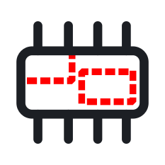

#  Layouts' Extents

Saves the extents of all the maps from all the layouts inside a temporary layer.

## Installation
### Requirements
You need to have QGIS 3.6+ installed.

### From this repo
 * Download as ZIP file
 * [Install a plugin from ZIP file](https://docs.qgis.org/3.40/en/docs/user_manual/plugins/plugins.html#the-install-from-zip-tab)

### From the official QGIS plugins repository
*To do…*

## Usage
Once installed, two things are added to your QGIS user interface:

 * A button  in the *Plugins* section of the toolbar
 * An element in the *Plugins* menu:
 

**Both create a new temporary layer with the layouts' extents.**

The layer has the following fields:

 * `layout_name`: name of the layout from which the extent is taken

 * `map_name`: name of the *map* object in the layout
 
 * `atlas_feature` (implementation in progress, useless for now)

## Example

### Requirements

A QGIS project with one or more layouts.

### Results

A layer with extents show on the canvas.

## To do

 - [x] Take into account: scale, rotation of map

 - [ ] Manage atlases
 
 - [ ] Add a result dialog for errors or zero layouts

 - [ ] Custom styling, choose offset and outline style
 
 - [ ] An *update* button that updates an existing *Layouts Extents* layer if it already exists

## Notes

You can view the layouts extents natively on the canvas with *View → Decorations → Layout Extents…*.

*Plugin made with [Plugin Builder 3](https://g-sherman.github.io/Qgis-Plugin-Builder/)*

*Code made with the help of an LLM*
